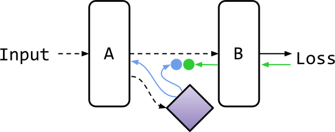
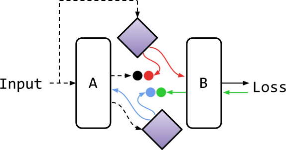
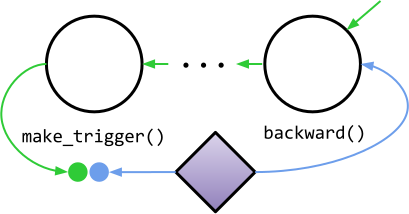

Decoupled Neural Interfaces for PyTorch
=======================================

This tiny library is an implementation of
`Decoupled Neural Interfaces using Synthetic Gradients <https://arxiv.org/abs/1608.05343>`_
for `PyTorch <http://pytorch.org/>`_.
It's very simple to use as it was designed to enable researchers to integrate
DNI into existing models with minimal amounts of code.

To install, run::

    $ python setup.py install

Description of the library and how to use it in some typical cases is provided
below. For more information, please read the code.

Terminology
-----------

This library uses a message passing abstraction introduced in the paper. Some
terms used in the API (matching those used in the paper wherever possible):

- ``Interface`` - A Decoupled Neural Interface that decouples two parts (let's
  call them part A and part B) of the network and lets them communicate via
  ``message`` passing. It may be ``Forward``, ``Backward`` or
  ``Bidirectional``.
- ``BackwardInterface`` - A type of ``Interface`` that the paper focuses on.
  It can be used to prevent update locking by predicting gradient for part A
  of the decoupled network based on the activation of its last layer.
- ``ForwardInterface`` - A type of ``Interface`` that can be used to prevent
  forward locking by predicting input for part B of the network based on some
  information known to both parts - in the paper it's the input of the whole
  network.
- ``BidirectionalInterface`` - A combination of ``ForwardInterface`` and
  ``BackwardInterface``, that can be used to achieve a complete unlock.
- ``message`` - Information that is passed through an ``Interface`` -
  activation of the last layer for ``ForwardInterface`` or gradient w.r.t.
  that activation for ``BackwardInterface``. Note that no original information
  passes through. A ``message`` is consumed by one end of the ``Interface``
  and used to update a ``Synthesizer``. Then the ``Synthesizer`` can be used
  produce a synthetic ``message`` at the other end of the ``Interface``.
- ``trigger`` - Information based on which ``message`` is synthesized. It needs
  to be accessible by both parts of the network. For ``BackwardInterface``, it's
  activation of the layer w.r.t. which gradient is to be synthesized. For
  ``ForwardInterface`` it can be anything - in the paper it's the input of
  the whole network.
- ``context`` - Additional information normally not shown to the network at
  the forward pass, that can condition an ``Interface`` to provide a better
  estimate of the ``message``. The paper uses labels for this purpose and calls
  DNI with context cDNI.
- ``send`` - A method of an ``Interface``, that takes as input ``message``
  and ``trigger``, based on which that ``message`` should be generated,
  and updates ``Synthesizer`` to improve the estimate.
- ``receive`` - A method of an ``Interface``, that takes as input ``trigger``
  and returns a ``message`` generated by a ``Synthesizer``.
- ``Synthesizer`` - A regression model that estimates ``message`` based on
  ``trigger`` and ``context``.

Typical use cases
-----------------

Synthetic Gradient for Feed-Forward Networks
^^^^^^^^^^^^^^^^^^^^^^^^^^^^^^^^^^^^^^^^^^^^

In this case we want to decouple two parts A and B of a neural network to
achieve an update unlock, so that there is a normal forward pass from part A to
B, but part A learns using synthetic gradient generated by the DNI.

Following the paper's convention, solid black arrows are update-locked forward
connections, dashed black arrows are update-unlocked forward connections, green
arrows are real error gradients and blue arrows are synthetic error gradients.
Full circles denote synthetic gradient loss computation and ``Synthesizer``
update.

We can use a ``BackwardInterface`` to do that:

.. code-block:: python

    class Network(torch.nn.Module):
    
        def __init__(self):
            # ...

            # 1. create a BackwardInterface, assuming that dimensionality of
            #    the activation for which we want to synthesize gradients is
            #    activation_dim
            self.backward_interface = dni.BackwardInterface(
                dni.BasicSynthesizer(output_dim=activation_dim, n_hidden=1)
            )

            # ...

        def forward(self, x):
            # ...

            # 2. call the BackwardInterface at the point where we want to
            #    decouple the network
            x = self.backward_interface(x)

            # ...

            return x

That's it! During the forward pass, ``BackwardInterface`` will use a
``Synthesizer`` to generate synthetic gradient w.r.t. activation, backpropagate
it and add to the computation graph a node that will intercept
the real gradient during the backward pass and use it to update the
``Synthesizer``'s estimate.

The ``Synthesizer`` used here is ``BasicSynthesizer`` - a multi-layer
perceptron with ReLU activation function. Writing a custom ``Synthesizer`` is
described at `Writing custom Synthesizers`_.

You can specify a ``context`` by passing ``context_dim`` (dimensionality of the
context vector) to the ``BasicSynthesizer`` constructor and wrapping all DNI
calls in the ``dni.synthesizer_context`` context manager:

.. code-block:: python

    class Network(torch.nn.Module):
    
        def __init__(self):
            # ...

            self.backward_interface = dni.BackwardInterface(
                dni.BasicSynthesizer(
                    output_dim=activation_dim, n_hidden=1,
                    context_dim=context_dim
                )
            )

            # ...

        def forward(self, x, y):
            # ...

            # assuming that context is labels given in variable y
            with dni.synthesizer_context(y):
                x = self.backward_interface(x)

            # ...

            return x

Example code for digit classification on MNIST is at
`examples/mnist-mlp <examples/mnist-mlp>`_.

Complete Unlock for Feed-Forward Networks
^^^^^^^^^^^^^^^^^^^^^^^^^^^^^^^^^^^^^

In this case we want to decouple two parts A and B of a neural network to
achieve forward and update unlock, so that part B receives synthetic input and
part A learns using synthetic gradient generated by the DNI.

Red arrows are synthetic inputs.

We can use a ``BidirectionalInterface`` to do that:

.. code-block:: python

    class Network(torch.nn.Module):
    
        def __init__(self):
            # ...

            # 1. create a BidirectionalInterface, assuming that dimensionality of
            #    the activation for which we want to synthesize gradients is
            #    activation_dim and dimensionality of the input of the whole
            #    network is input_dim
            self.bidirectional_interface = dni.BidirectionalInterface(
                # Synthesizer generating synthetic inputs for part B, trigger
                # here is the input of the network
                dni.BasicSynthesizer(
                    output_dim=activation_dim, n_hidden=1,
                    trigger_dim=input_dim
                ),
                # Synthesizer generating synthetic gradients for part A,
                # trigger here is the last activation of part A (no need to
                # specify dimensionality)
                dni.BasicSynthesizer(
                    output_dim=activation_dim, n_hidden=1
                )
            )

            # ...

        def forward(self, input):
            x = input

            # ...

            # 2. call the BidirectionalInterface at the point where we want to
            #    decouple the network, need to pass both the last activation
            #    and the trigger, which in this case is the input of the whole
            #    network
            x = self.backward_interface(x, input)

            # ...

            return x

During the forward pass, ``BidirectionalInterface`` will receive real
activation, use it to update the input ``Synthesizer``, generate synthetic
gradient w.r.t. that activation using the gradient ``Synthesizer``,
backpropagate it, generate synthetic input using the input ``Synthesizer``
and attach to it a computation graph node that will intercept the real gradient
w.r.t. the synthetic input and use it to update the gradient ``Synthesizer``.

Example code for digit classification on MNIST is at
`examples/mnist-full-unlock <examples/mnist-full-unlock>`_.

Writing custom Synthesizers
^^^^^^^^^^^^^^^^^^^^^^^^^^^

This library includes only ``BasicSynthesizer`` - a very simple ``Synthesizer``
based on a multi-layer perceptron with ReLU activation function. It may not be
sufficient for all cases, for example for classifying MNIST digits using a CNN
the paper uses a ``Synthesizer`` that is also a CNN.

You can easily write a custom ``Synthesizer`` by subclassing
``torch.nn.Module`` with method ``forward`` taking ``trigger`` and ``context``
as arguments and returning a synthetic ``message``:

.. code-block:: python

    class CustomSynthesizer(torch.nn.Module):

        def forward(self, trigger, context):
            # synthesize the message
            return message

``trigger`` will be a ``torch.autograd.Variable`` and ``context`` will be
whatever is passed to the ``dni.synthesizer_context`` context manager, or
``None`` if ``dni.synthesizer_context`` is not used.

Example code for digit classification on MNIST using a CNN is at
`examples/mnist-cnn <examples/mnist-cnn>`_.

Synthetic Gradient for Recurrent Networks
^^^^^^^^^^^^^^^^^^^^^^^^^^^^^^^^^^^^^^^^^

In this case we want to use DNI to approximate gradient from an
infinitely-unrolled recurrent neural network and feed it to the last step of
the RNN unrolled by truncated BPTT.

We can use methods ``make_trigger`` and ``backward`` of ``BackwardInterface``
to do that:

.. code-block:: python

    class Network(torch.nn.module):

        def __init__(self):
            # ...

            # 1. create a BackwardInterface, assuming that dimensionality of
            #    the RNN hidden state is hidden_dim
            self.backward_interface = dni.BackwardInterface(
                dni.BasicSynthesizer(output_dim=hidden_dim, n_hidden=1)
            )

            # ...

        def forward(self, input, hidden):
            # ...

            # 2. call make_trigger on the first state of the unrolled RNN
            hidden = self.backward_interface.make_trigger(hidden)
            # run the RNN
            (output, hidden) = self.rnn(input, hidden)
            # 3. call backward on the last state of the unrolled RNN
            self.backward_interface.backward(hidden)

            # ...

    # in the training loop:
    with dni.defer_backward():
        (output, hidden) = model(input, hidden)
        loss = criterion(output, target)
        dni.backward(loss)

``BackwardInterface.make_trigger`` marks the first hidden state as a
``trigger`` used to update the gradient estimate. During the backward pass,
gradient passing through the ``trigger`` will be compared to synthetic gradient
generated based on the same ``trigger`` and the ``Synthesizer`` will be
updated. ``BackwardInterface.backward`` computes synthetic gradient based on
the last hidden state and backpropagates it.

Because we are passing both real and synthetic gradients through the same nodes
in the computation graph, we need to use ``dni.defer_backward`` and
``dni.backward``. ``dni.defer_backward`` is a context manager that accumulates
all gradients passed to ``dni.backward`` (including those generated by
``Interfaces``) and backpropagates them all at once in the end. If we don't do
that, PyTorch will complain about backpropagating twice through the same
computation graph.

Example code for word-level language modeling on Penn Treebank is at
`examples/rnn <examples/rnn>`_.

Distributed training with a Complete Unlock
^^^^^^^^^^^^^^^^^^^^^^^^^^^^^^^^^^^^^^^^^^^

The paper describes distributed training of complex neural architectures as one
of the potential uses of DNI. In this case we have a network split into parts
A and B trained independently, perhaps on different machines, communicating via
DNI. We can use methods ``send`` and ``receive`` of ``BidirectionalInterface``
to do that:

.. code-block:: python

    class PartA(torch.nn.Module):

        def forward(self, input):
            x = input

            # ...

            # send the intermediate results computed by part A via DNI
            self.bidirectional_interface.send(x, input)

    class PartB(torch.nn.Module):

        def forward(self, input):
            # receive the intermediate results computed by part A via DNI
            x = self.bidirectional_interface.receive(input)

            # ...

            return x

``PartA`` and ``PartB`` have their own copies of the
``BidirectionalInterface``. ``BidirectionalInterface.send`` will compute
synthetic gradient w.r.t. ``x`` (intermediate results computed by ``PartA``)
based on ``x`` and ``input`` (input of the whole network), backpropagate it and
update the estimate of ``x``. ``BidirectionalInterface.receive`` will compute
synthetic ``x`` based on ``input`` and in the backward pass, update the
estimate of the gradient w.r.t. ``x``. This should work as long as
``BidirectionalInterface`` parameters are synchronized between ``PartA`` and
``PartB`` once in a while.

There is no example code for this use case yet. Contributions welcome!
